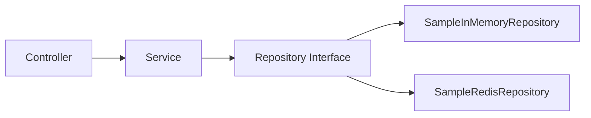
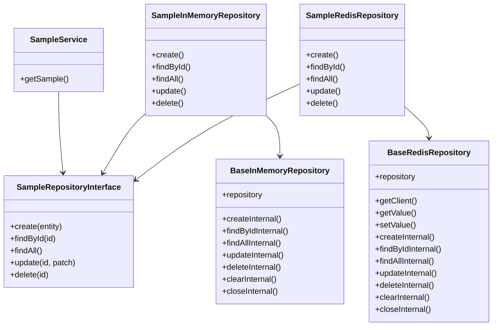

# Repository Implementation Guide

This document explains how the repository layer is implemented in this project. It is written for freshers and includes simple diagrams to make the architecture easier to understand.

---

## What is a Repository?

A repository is a software pattern used to separate data storage from business logic.

In this project, the repository layer handles:
- saving data
- loading data
- updating data
- deleting data

The rest of the application does not need to know whether the data is stored in memory or Redis.

---

## Main Repository Concepts

### 1. Repository Interfaces

The code defines two main interface types:

- `BaseRepositoryInterface`
  - Common lifecycle methods: `clear()` and `close()`
  - Used by base repository classes
- `SampleRepositoryInterface`
  - CRUD methods for the sample entity:
    - `create()`
    - `findById()`
    - `findAll()`
    - `update()`
    - `delete()`

This means the service layer depends only on the contract, not the implementation.

### 2. Base Repository Classes

The project includes two reusable base repository classes:

- `BaseInMemoryRepository<T>`
  - Stores data in a JavaScript `Map`
  - Uses a table name to separate data sets
  - Good for local development and tests
- `BaseRedisRepository<T>`
  - Stores data in Redis using a single key per table name
  - Uses a Redis client connection
  - Good for production-like persistence

Both base classes provide the same operations: `create`, `findById`, `findAll`, `update`, `delete`, `clear`, and `close`.

### 3. Concrete Sample Repositories

The sample feature provides two concrete implementations:

- `SampleInMemoryRepository`
- `SampleRedisRepository`

Both classes:
- extend a base class
- implement `SampleRepositoryInterface`
- expose the same methods
- can be swapped without changing the service layer

---

## How the Repository Works

### Data flow

1. `SampleService` asks for data.
2. The service uses `SampleRepositoryInterface`.
3. A concrete repository implementation performs the actual storage.
4. The service receives the result.

This keeps business code clean and testable.

### Diagram: Layered Flow

### Diagram: Repository Structure

---

## Key Files and What They Do

- `src/repositories/base.repository.interface.ts`
  - Defines `clear()` and `close()` for repositories.
- `src/repositories/base.in-memory.repository.ts`
  - Provides a reusable in-memory repository implementation.
- `src/repositories/base.redis.repository.ts`
  - Provides a reusable Redis repository implementation.
- `src/repositories/sample/sample.repository.interface.ts`
  - Defines CRUD methods for the sample entity.
- `src/repositories/sample/sample.in-memory.repository.ts`
  - Concrete in-memory sample repository.
- `src/repositories/sample/sample.redis.repository.ts`
  - Concrete Redis sample repository.

---

## Example: How `SampleService` Uses the Repository

In `src/modules/sample/sample.service.ts`:

- The service injects `SAMPLE_REPOSITORY`
- The repository is declared using the interface type
- The service code calls methods such as `findAll()` and `create()`

This means the service can work with any repository that follows the interface.

---
